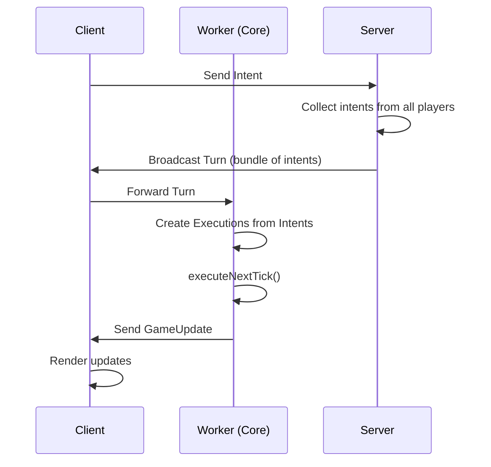

OpenFront uses a distributed client-server architecture with deterministic simulation to ensure consistent gameplay across all players.

## Architecture Overview

The game is split into four components:

<CardGroup cols={2}>
  <Card title="Client" icon="browser" href="#client-component">
    Handles rendering, UI, and user input
  </Card>
  <Card title="Core" icon="gear" href="#core-component">
    Deterministic simulation engine
  </Card>
  <Card title="Server" icon="server" href="#server-component">
    Coordinates players and relays game state
  </Card>
  <Card title="API" icon="cloud" href="#api-component">
    Authentication, stats, and monetization
  </Card>
</CardGroup>

## Client Component

**Location:** `/src/client/`

The client is responsible for:
- Rendering game graphics using PixiJS
- Handling user input and UI interactions
- Managing the WebSocket connection to the game server
- Running a Web Worker that executes the core simulation
- Displaying game updates received from the core

<Note>
  The client does NOT handle game logic. All game state modifications happen in the core component.
</Note>

### Key Technologies
- **PixiJS** for 2D rendering
- **Lit** for UI components
- **Web Workers** for running core simulation in a separate thread
- **Vite** for development and bundling

## Core Component

**Location:** `/src/core/`

The core is the heart of OpenFront's deterministic simulation:

<Warning>
  The core MUST be fully deterministic with no external dependencies. Any randomness must use seeded random number generators.
</Warning>

### Core Characteristics
- Pure TypeScript/JavaScript with no external dependencies
- Runs in a Web Worker on the client side
- Fully deterministic - given the same inputs, always produces the same outputs
- Executes game logic through the Intent → Execution pattern

### Why Deterministic?

By making the simulation deterministic, each client can run its own instance of the game logic. This eliminates the need for the server to simulate the game, reducing server load and enabling game replays.

## Server Component

**Location:** `/src/server/`

The server is a lightweight coordinator built with Express and WebSockets:

- Manages player connections
- Collects intents from all players
- Bundles intents into "turns" and broadcasts them
- Does NOT run game simulation
- Handles lobby creation and matchmaking

<Info>
  The server does not validate game logic. It trusts that all clients running the same deterministic core will reach the same game state.
</Info>

## API Component

**Location:** Closed-source Cloudflare Worker

The API handles:
- User authentication and accounts
- Player statistics and leaderboards
- Game data storage
- Cosmetics and monetization
- RESTful endpoints for non-realtime operations

## Simulation Architecture

### Client-Side Simulation

The game simulation does not run on the server. Instead, **each client runs their own instance of core** in a Web Worker thread. This architecture:

- Reduces server computational load
- Enables instant local feedback
- Allows game replays by re-running intents
- Requires strict determinism in the core

### Communication Flow



## Game Flow

<Steps>
  <Step title="Player Action">
    User performs an action (e.g., attack territory, build structure)
  </Step>
  
  <Step title="Intent Creation">
    Client creates an "Intent" representing the action and sends it to the server
  </Step>
  
  <Step title="Server Aggregation">
    Server collects all intents from all players for the current tick/turn
  </Step>
  
  <Step title="Turn Broadcast">
    Server bundles intents into a "Turn" and broadcasts to all clients
  </Step>
  
  <Step title="Core Processing">
    Each client forwards the turn to its core simulation
  </Step>
  
  <Step title="Execution Creation">
    Core creates an "Execution" for each intent. Executions are the only thing that can modify game state
  </Step>
  
  <Step title="Tick Execution">
    Core calls `executeNextTick()` and all executions run deterministically
  </Step>
  
  <Step title="Update Broadcast">
    Core sends GameUpdate to the client with changes
  </Step>
  
  <Step title="Rendering">
    Client renders the updates to the player's screen
  </Step>
</Steps>

## Intent → Execution Pattern

<CodeGroup>
```typescript Intent (User Action)
// Example: Player wants to attack a territory
const intent: AttackIntent = {
  type: "ATTACK",
  playerId: "player1",
  from: territoryA,
  to: territoryB,
  troops: 50
};
```

```typescript Execution (Game Logic)
// Core creates execution from intent
class AttackExecution implements Execution {
  execute(gameState: GameState) {
    // Deterministic logic to modify game state
    const attackResult = calculateAttack(
      this.from,
      this.to,
      this.troops,
      gameState.seed
    );
    
    gameState.territories[this.from].troops -= this.troops;
    gameState.territories[this.to].troops = attackResult.remaining;
  }
}
```
</CodeGroup>

<Warning>
  Only Executions can modify game state. Intents are just requests that must be validated and converted to Executions.
</Warning>

## Directory Structure

```
src/
├── client/          # Frontend rendering and UI
│   ├── rendering/   # PixiJS rendering logic
│   ├── ui/          # Lit components
│   └── workers/     # Web Worker setup
├── core/            # Deterministic game simulation
│   ├── intents/     # Intent definitions
│   ├── executions/  # Execution implementations
│   ├── entities/    # Game entities (territories, units)
│   └── state/       # Game state management
└── server/          # Express + WebSocket server
    ├── lobby/       # Lobby management
    └── game/        # Game coordination
```

## Key Design Principles

1. **Determinism First**: Core must be deterministic to enable client-side simulation
2. **Separation of Concerns**: Client renders, core simulates, server coordinates
3. **Intent-Based Actions**: All player actions are intents that become executions
4. **No Server Simulation**: Server never runs game logic, only relays data
5. **Thread Isolation**: Core runs in a Web Worker for performance

## Related Documentation

<CardGroup cols={2}>
  <Card title="Development Setup" icon="wrench" href="/development/setup">
    Set up your local development environment
  </Card>
  <Card title="Testing Guide" icon="flask" href="/development/testing">
    Learn how to test core game logic
  </Card>
</CardGroup>