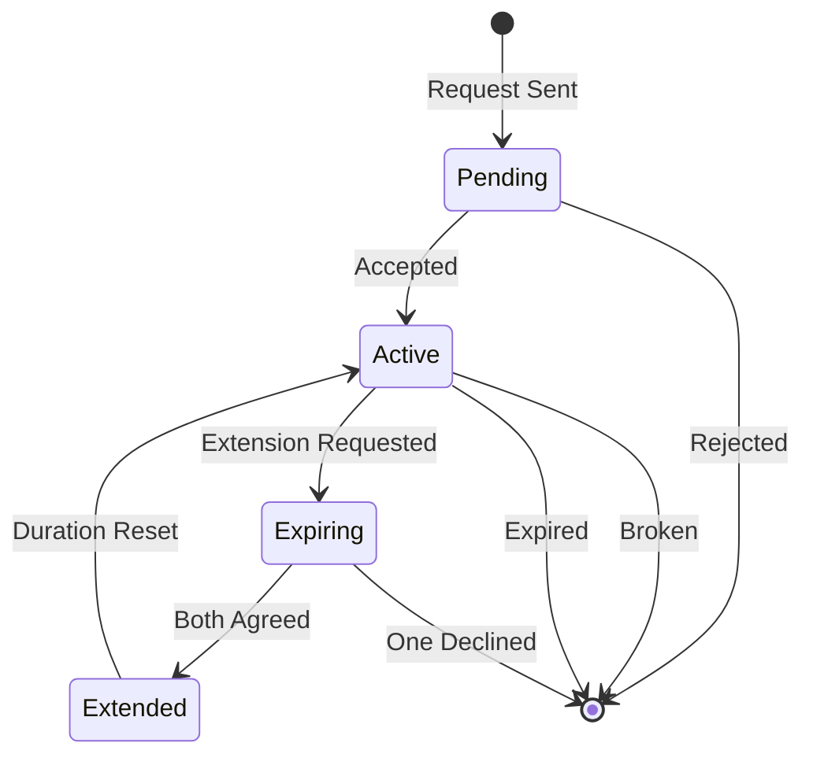

## Overview

OpenFront's alliance system enables temporary cooperation between players. Alliances are time-limited, require mutual consent, can be extended, and affect various game mechanics including attacks, trades, and diplomacy.

## Core Concepts

### Alliance Properties

- **Time-Limited**: Alliances expire after a configured duration
- **Bilateral**: Require acceptance from both players
- **Extensible**: Can be renewed if both parties agree
- **Breakable**: Either player can break the alliance
- **Embargo-Creating**: Attacking creates automatic embargo

## Alliance Implementation

The `AllianceImpl` class manages alliance state and lifecycle:

```typescript src/core/game/AllianceImpl.ts
export class AllianceImpl implements MutableAlliance {
  private extensionRequestedRequestor_: boolean = false;
  private extensionRequestedRecipient_: boolean = false;
  private expiresAt_: Tick;

  constructor(
    private readonly mg: Game,
    readonly requestor_: Player,
    readonly recipient_: Player,
    private readonly createdAt_: Tick,
    private readonly id_: number,
  ) {
    this.expiresAt_ = createdAt_ + mg.config().allianceDuration();
  }

  other(player: Player): Player {
    if (this.requestor_ === player) {
      return this.recipient_;
    }
    return this.requestor_;
  }

  requestor(): Player {
    return this.requestor_;
  }

  recipient(): Player {
    return this.recipient_;
  }

  createdAt(): Tick {
    return this.createdAt_;
  }

  expiresAt(): Tick {
    return this.expiresAt_;
  }
}
```

<ParamField path="requestor" type="Player">
  The player who initiated the alliance request
</ParamField>

<ParamField path="recipient" type="Player">
  The player who received and accepted the request
</ParamField>

<ParamField path="createdAt" type="Tick">
  The game tick when the alliance was formed
</ParamField>

<ParamField path="expiresAt" type="Tick">
  The game tick when the alliance will expire if not extended
</ParamField>

<ParamField path="id" type="number">
  Unique identifier for this alliance
</ParamField>

## Alliance Lifecycle

### 1. Request Phase

A player creates an alliance request:

```typescript src/core/game/AllianceRequestImpl.ts
export class AllianceRequestImpl implements AllianceRequest {
  private status_: "pending" | "accepted" | "rejected" = "pending";

  constructor(
    private requestor_: Player,
    private recipient_: Player,
    private tickCreated: number,
    private game: GameImpl,
  ) {}

  status(): "pending" | "accepted" | "rejected" {
    return this.status_;
  }

  accept(): void {
    this.status_ = "accepted";
    this.game.acceptAllianceRequest(this);
  }

  reject(): void {
    this.status_ = "rejected";
    this.game.rejectAllianceRequest(this);
  }
}
```

### 2. Acceptance/Rejection

The recipient can accept or reject:

- **Accept**: Creates an `AllianceImpl` object
- **Reject**: Removes the request, no alliance formed

### 3. Active Alliance

Once accepted, the alliance is active until expiration or break:



### 4. Extension System

Alliances can be extended if both players agree:

```typescript src/core/game/AllianceImpl.ts
addExtensionRequest(player: Player): void {
  if (this.requestor_ === player) {
    this.extensionRequestedRequestor_ = true;
  } else if (this.recipient_ === player) {
    this.extensionRequestedRecipient_ = true;
  }
  this.mg.addUpdate({
    type: GameUpdateType.AllianceExtension,
    playerID: player.smallID(),
    allianceID: this.id_,
  });
}

bothAgreedToExtend(): boolean {
  return (
    this.extensionRequestedRequestor_ && this.extensionRequestedRecipient_
  );
}

onlyOneAgreedToExtend(): boolean {
  return (
    this.extensionRequestedRequestor_ !== this.extensionRequestedRecipient_
  );
}

extend(): void {
  this.extensionRequestedRequestor_ = false;
  this.extensionRequestedRecipient_ = false;
  this.expiresAt_ = this.mg.ticks() + this.mg.config().allianceDuration();
}
```

<Info>
Both players must request extension for it to succeed. If only one requests, the alliance expires normally.
</Info>

### 5. Expiration

When an alliance expires:

```typescript src/core/game/AllianceImpl.ts
expire(): void {
  this.mg.expireAlliance(this);
}
```

The game removes the alliance and updates both players' alliance lists.

## Alliance Executions

Alliance actions are implemented as executions:

### AllianceRequestExecution

```typescript src/core/execution/alliance/AllianceRequestExecution.ts
export class AllianceRequestExecution implements Execution {
  constructor(
    private player: Player,
    private recipient: PlayerID,
  ) {}

  init(game: Game, ticks: number) {
    // Validate recipient exists and is eligible
    // Create AllianceRequestImpl
    // Add to both players' request lists
  }

  tick(ticks: number) {
    // Single-tick execution
    this.active = false;
  }
}
```

### AllianceRejectExecution

```typescript src/core/execution/alliance/AllianceRejectExecution.ts
export class AllianceRejectExecution implements Execution {
  constructor(
    private requestorID: PlayerID,
    private player: Player,
  ) {}

  init(game: Game, ticks: number) {
    // Find and reject the request
    const request = this.player
      .incomingAllianceRequests()
      .find((ar) => ar.requestor().id() === this.requestorID);
    
    if (request) {
      request.reject();
    }
  }
}
```

### AllianceExtensionExecution

```typescript src/core/execution/alliance/AllianceExtensionExecution.ts
export class AllianceExtensionExecution implements Execution {
  constructor(
    private player: Player,
    private recipient: PlayerID,
  ) {}

  init(game: Game, ticks: number) {
    const alliance = this.player.getAllianceWith(this.recipient);
    
    if (alliance) {
      alliance.addExtensionRequest(this.player);
      
      if (alliance.bothAgreedToExtend()) {
        alliance.extend();
      }
    }
  }
}
```

### BreakAllianceExecution

```typescript src/core/execution/alliance/BreakAllianceExecution.ts
export class BreakAllianceExecution implements Execution {
  constructor(
    private player: Player,
    private recipient: PlayerID,
  ) {}

  init(game: Game, ticks: number) {
    const alliance = this.player.getAllianceWith(this.recipient);
    
    if (alliance) {
      alliance.expire();
    }
  }
}
```

<Note>
All alliance executions are single-tick operations that complete immediately in their `init()` method.
</Note>

## Friendship System

Alliances are part of a broader "friendship" concept:

```typescript
class Player {
  isFriendly(other: Player): boolean {
    // Returns true if:
    // 1. Players are allied, OR
    // 2. Players are on the same team
    return this.isAlliedWith(other) || this.onSameTeam(other);
  }

  isAlliedWith(other: Player): boolean {
    return this.getAllianceWith(other) !== null;
  }
}
```

## Game Mechanics Affected by Alliances

### Attack Restrictions

Players cannot attack friendly players:

```typescript src/core/execution/AttackExecution.ts
init(mg: Game, ticks: number) {
  // Alliance check - block attacks on friendly players
  if (this.target.isPlayer()) {
    const targetPlayer = this.target as Player;
    if (this._owner.isFriendly(targetPlayer)) {
      console.warn(
        `${this._owner.displayName()} cannot attack ${targetPlayer.displayName()} because they are friendly`
      );
      this.active = false;
      return;
    }
  }
}

tick(ticks: number) {
  // Check for new alliance during attack
  if (targetPlayer && this._owner.isFriendly(targetPlayer)) {
    this.retreat();
    return;
  }
}
```

<Info>
If an alliance is formed while an attack is in progress, the attack immediately retreats with no penalty.
</Info>

### Trade and Donations

Alliances enable resource sharing:

```typescript
class Player {
  canDonateGold(other: Player): boolean {
    return this.isFriendly(other);
  }

  canDonateTroops(other: Player): boolean {
    return this.isFriendly(other);
  }
}
```

### Embargoes

Attacking a player creates an automatic embargo:

```typescript src/core/execution/AttackExecution.ts
if (this.target && this.target.isPlayer()) {
  const targetPlayer = this.target as Player;
  if (
    targetPlayer.type() !== PlayerType.Bot &&
    this._owner.type() !== PlayerType.Bot
  ) {
    targetPlayer.addEmbargo(this._owner, true);
    this.rejectIncomingAllianceRequests(targetPlayer);
  }
}
```

<Note>
Bots don't participate in embargoes since they can't trade anyway.
</Note>

### Incoming Request Rejection

Attacking auto-rejects pending alliance requests:

```typescript src/core/execution/AttackExecution.ts
private rejectIncomingAllianceRequests(target: Player) {
  const request = this._owner
    .incomingAllianceRequests()
    .find((ar) => ar.requestor() === target);
  if (request !== undefined) {
    request.reject();
  }
}
```

## Player Actions

The `GameRunner` provides alliance-related actions:

```typescript src/core/GameRunner.ts
public playerActions(
  playerID: PlayerID,
  x?: number,
  y?: number,
  units?: UnitType[],
): PlayerActions {
  const player = this.game.player(playerID);
  const tile = x !== undefined && y !== undefined ? this.game.ref(x, y) : null;
  
  const actions = {
    // ... other actions
  } as PlayerActions;

  if (tile !== null && this.game.hasOwner(tile)) {
    const other = this.game.owner(tile) as Player;
    actions.interaction = {
      sharedBorder: player.sharesBorderWith(other),
      canSendAllianceRequest: player.canSendAllianceRequest(other),
      canBreakAlliance: player.isAlliedWith(other),
      allianceInfo: player.allianceInfo(other) ?? undefined,
    };
  }

  return actions;
}
```

<ParamField path="canSendAllianceRequest" type="boolean">
  Whether the player can send an alliance request to the other player
</ParamField>

<ParamField path="canBreakAlliance" type="boolean">
  Whether the player can break an existing alliance
</ParamField>

<ParamField path="allianceInfo" type="AllianceInfo | undefined">
  Information about the current alliance status, if any
</ParamField>

## Configuration

Alliance behavior is configured through the game config:

```typescript
interface Config {
  allianceDuration(): number; // Ticks until alliance expires
}
```

Typical values:
- **Short**: 3000 ticks (~5 minutes at 10 ticks/second)
- **Medium**: 6000 ticks (~10 minutes)
- **Long**: 12000 ticks (~20 minutes)

## Best Practices

### For Players

1. **Request Early**: Alliance requests take time to accept
2. **Communicate**: Use emojis/quick chat to coordinate
3. **Watch Expiration**: Request extension before alliance expires
4. **Plan Breaks**: Breaking alliances has diplomatic consequences

### For Developers

1. **Check Friendship**: Use `isFriendly()` not just `isAlliedWith()`
2. **Handle Timing**: Alliances can form/break mid-attack
3. **Update UI**: Show alliance status clearly
4. **Test Edge Cases**: Alliance + team, alliance + embargo, etc.

## Related Systems

- [Intent/Execution](/systems/intents-executions) - Alliance actions use execution pattern
- [Game Loop](/systems/game-loop) - Alliance expiration checked each tick
- [Pathfinding](/systems/pathfinding) - Allied players may share vision