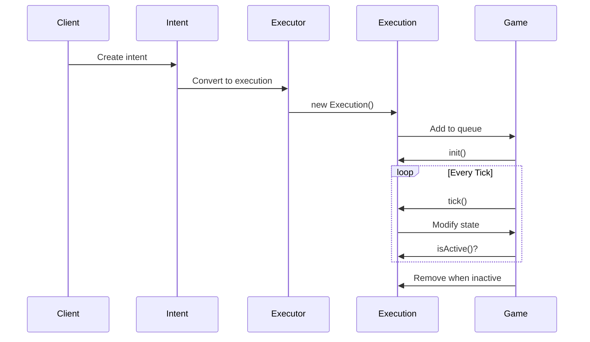

## Overview

OpenFront uses an Intent/Execution pattern to separate player actions from game state modifications. This pattern ensures deterministic gameplay, enables replay functionality, and maintains clean separation between client input and server logic.

## Architecture

### Intent Layer

Intents represent player actions in a serializable, validated format. They are:

- **Immutable**: Once created, intents cannot be modified
- **Serializable**: Can be sent over network or saved to disk
- **Validated**: Schema-validated using Zod before processing
- **Timestamped**: Tagged with client ID and turn information

### Execution Layer

Executions are stateful objects that modify game state over multiple ticks. They:

- **Process Incrementally**: Can take multiple ticks to complete
- **Maintain State**: Track progress of ongoing operations
- **Can Be Cancelled**: Support interruption and cleanup
- **Modify Game State**: Direct access to game objects

## Intent Types

OpenFront supports various intent types defined in `src/core/Schemas.ts`:

```typescript
type Intent =
  | SpawnIntent
  | AttackIntent
  | CancelAttackIntent
  | BoatAttackIntent
  | CancelBoatIntent
  | AllianceRequestIntent
  | AllianceRejectIntent
  | AllianceExtensionIntent
  | BreakAllianceIntent
  | TargetPlayerIntent
  | EmojiIntent
  | DonateGoldIntent
  | DonateTroopsIntent
  | BuildUnitIntent
  | EmbargoIntent
  | QuickChatIntent
  | MoveWarshipIntent
  | MarkDisconnectedIntent
  | EmbargoAllIntent
  | UpgradeStructureIntent
  | DeleteUnitIntent
  | TogglePauseIntent;
```

## Executor: Intent to Execution Conversion

The `Executor` class (src/core/execution/ExecutionManager.ts:32) converts intents into execution objects:

```typescript src/core/execution/ExecutionManager.ts
export class Executor {
  private random: PseudoRandom;

  constructor(
    private mg: Game,
    private gameID: GameID,
    private clientID: ClientID,
  ) {
    this.random = new PseudoRandom(simpleHash(gameID) + 1);
  }

  createExecs(turn: Turn): Execution[] {
    return turn.intents.map((i) => this.createExec(i));
  }

  createExec(intent: StampedIntent): Execution {
    const player = this.mg.playerByClientID(intent.clientID);
    if (!player) {
      console.warn(`player with clientID ${intent.clientID} not found`);
      return new NoOpExecution();
    }

    switch (intent.type) {
      case "attack":
        return new AttackExecution(
          intent.troops,
          player,
          intent.targetID,
          null,
        );
      case "spawn":
        return new SpawnExecution(this.gameID, player.info(), intent.tile);
      case "allianceRequest":
        return new AllianceRequestExecution(player, intent.recipient);
      case "build_unit":
        return new ConstructionExecution(
          player,
          intent.unit,
          intent.tile,
          intent.rocketDirectionUp,
        );
      // ... more cases
    }
  }
}
```

<Note>
Invalid intents (e.g., from disconnected players) are converted to `NoOpExecution` to maintain deterministic execution order.
</Note>

## Execution Interface

All executions implement the `Execution` interface:

```typescript
interface Execution {
  init(game: Game, ticks: number): void;
  tick(ticks: number): void;
  isActive(): boolean;
  activeDuringSpawnPhase(): boolean;
}
```

<ParamField path="init" type="(game: Game, ticks: number) => void">
  Called once when the execution is added to the game. Performs validation and setup.
</ParamField>

<ParamField path="tick" type="(ticks: number) => void">
  Called every game tick while the execution is active. Performs incremental state updates.
</ParamField>

<ParamField path="isActive" type="() => boolean">
  Returns whether the execution should continue processing. Inactive executions are removed.
</ParamField>

<ParamField path="activeDuringSpawnPhase" type="() => boolean">
  Returns whether this execution runs during the spawn phase or only during normal gameplay.
</ParamField>

## Example: Attack Execution

The `AttackExecution` class demonstrates the pattern in action:

```typescript src/core/execution/AttackExecution.ts
export class AttackExecution implements Execution {
  private active: boolean = true;
  private toConquer = new FlatBinaryHeap();
  private random = new PseudoRandom(123);
  private target: Player | TerraNullius;
  private mg: Game;
  private attack: Attack | null = null;

  constructor(
    private startTroops: number | null = null,
    private _owner: Player,
    private _targetID: PlayerID | null,
    private sourceTile: TileRef | null = null,
    private removeTroops: boolean = true,
  ) {}

  activeDuringSpawnPhase(): boolean {
    return false;
  }

  init(mg: Game, ticks: number) {
    if (!this.active) return;
    this.mg = mg;

    // Validate target exists
    if (this._targetID !== null && !mg.hasPlayer(this._targetID)) {
      console.warn(`target ${this._targetID} not found`);
      this.active = false;
      return;
    }

    this.target =
      this._targetID === this.mg.terraNullius().id()
        ? mg.terraNullius()
        : mg.player(this._targetID);

    // Alliance check - block attacks on friendly players
    if (this.target.isPlayer()) {
      const targetPlayer = this.target as Player;
      if (this._owner.isFriendly(targetPlayer)) {
        console.warn(
          `${this._owner.displayName()} cannot attack ${targetPlayer.displayName()} because they are friendly`
        );
        this.active = false;
        return;
      }
    }

    // Create attack object
    this.startTroops ??= this.mg.config().attackAmount(this._owner, this.target);
    if (this.removeTroops) {
      this.startTroops = Math.min(this._owner.troops(), this.startTroops);
      this._owner.removeTroops(this.startTroops);
    }
    this.attack = this._owner.createAttack(
      this.target,
      this.startTroops,
      this.sourceTile,
      new Set<TileRef>(),
    );

    // Record stats
    this.mg.stats().attack(this._owner, this.target, this.startTroops);
  }

  tick(ticks: number) {
    if (this.attack === null) {
      throw new Error("Attack not initialized");
    }

    // Check for retreat
    if (this.attack.retreated()) {
      this.retreat(targetIsPlayer ? malusForRetreat : 0);
      this.active = false;
      return;
    }

    // Check for new alliance
    if (targetPlayer && this._owner.isFriendly(targetPlayer)) {
      this.retreat();
      return;
    }

    // Conquer tiles
    let numTilesPerTick = this.mg.config().attackTilesPerTick(
      troopCount,
      this._owner,
      this.target,
      this.attack.borderSize() + this.random.nextInt(0, 5),
    );

    while (numTilesPerTick > 0) {
      // Tile conquest logic...
      this._owner.conquer(tileToConquer);
      numTilesPerTick--;
    }
  }

  isActive(): boolean {
    return this.active;
  }
}
```

### Key Features

1. **Validation in Init**: Checks target validity and alliance status before starting
2. **Incremental Progress**: Conquers tiles over multiple ticks based on troop count
3. **State Management**: Tracks attack progress, border tiles, and troop losses
4. **Dynamic Cancellation**: Can be cancelled if alliance forms during attack
5. **Performance Optimization**: Uses heap data structure for efficient tile selection

<Info>
The attack execution demonstrates how complex, multi-tick operations are managed through the execution pattern.
</Info>

## Execution Lifecycle

1. **Creation**: Intent converted to execution by `Executor`
2. **Registration**: Added to game's execution queue
3. **Initialization**: `init()` called once, performs validation
4. **Processing**: `tick()` called every frame while active
5. **Completion**: Sets `active = false` when done
6. **Removal**: Game removes inactive executions



## Benefits of the Pattern

### Determinism

All state changes go through executions, ensuring reproducible game state:

- Same intents → Same executions → Same results
- Critical for multiplayer synchronization
- Enables replay and time-travel debugging

### Separation of Concerns

- **Client**: Creates intents, doesn't know game rules
- **Network**: Serializes intents, doesn't execute logic
- **Server**: Converts intents to executions
- **Game**: Executes changes, doesn't know network

### Extensibility

Adding new actions requires:

1. Define new intent type in schemas
2. Add case to `Executor.createExec()`
3. Implement new execution class
4. No changes to core game loop

<Note>
The Intent/Execution pattern is the foundation of OpenFront's architecture. Understanding it is essential for implementing new features.
</Note>

## Common Execution Types

### Instant Executions

Complete in a single tick:

- `AllianceRequestExecution` - Sends alliance request
- `EmojiExecution` - Sends emoji message
- `DonateGoldExecution` - Transfers gold

### Ongoing Executions

Run every tick:

- `WinCheckExecution` - Checks win conditions
- `RecomputeRailClusterExecution` - Updates rail network

### Multi-tick Executions

Process over many ticks:

- `AttackExecution` - Conquers tiles incrementally
- `TransportShipExecution` - Moves units across water
- `NationExecution` - AI player behavior

## Related Systems

- [Game Loop](/systems/game-loop) - How executions are processed each tick
- [Pathfinding](/systems/pathfinding) - Used by movement executions
- [Alliances](/systems/alliances) - Alliance-related executions