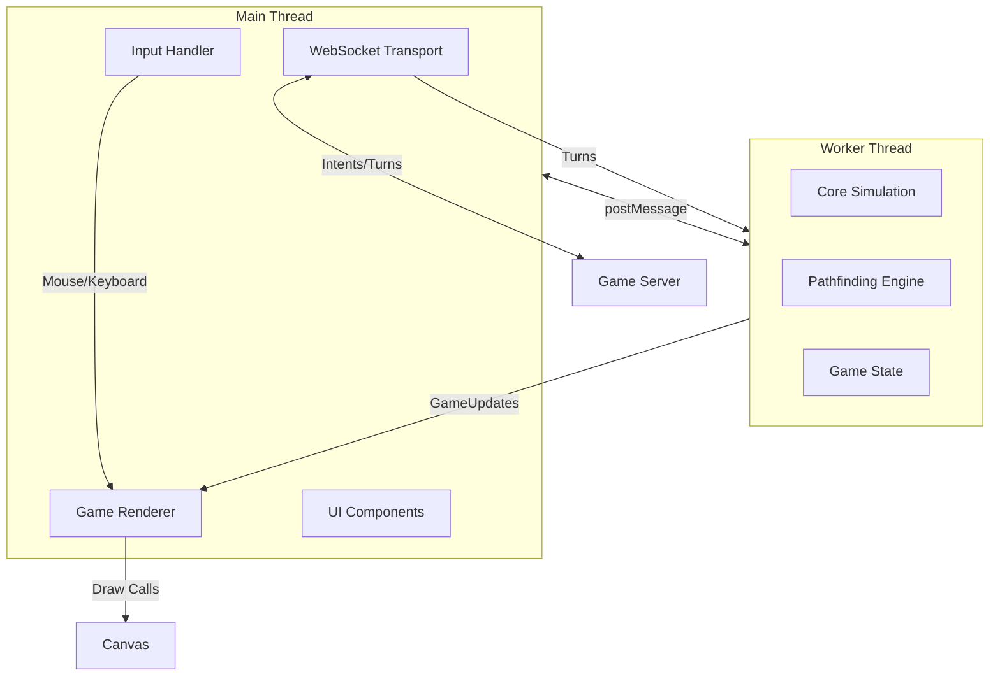

## Overview

The OpenFront client uses a **multi-threaded architecture** that separates game simulation from rendering:

- **Main Thread** - UI, rendering (PixiJS), user input handling
- **Worker Thread** - Core simulation, pathfinding, game logic

This separation ensures smooth 60 FPS rendering even during heavy simulation work.

## Architecture Diagram



## Core Components

### ClientGameRunner

The main orchestrator that coordinates all client systems.

**File:** `src/client/ClientGameRunner.ts`

```typescript
export class ClientGameRunner {
  constructor(
    private lobby: LobbyConfig,
    private clientID: ClientID,
    private eventBus: EventBus,
    private renderer: GameRenderer,
    private input: InputHandler,
    private transport: Transport,
    private worker: WorkerClient,
    private gameView: GameView,
  ) {}

  public start() {
    // Initialize rendering and input
    this.renderer.initialize();
    this.input.initialize();
    
    // Start worker simulation
    this.worker.start((gameUpdate) => {
      this.gameView.update(gameUpdate);
      this.renderer.tick();
    });
  }
}
```

**Responsibilities:**
- Lifecycle management (start, stop)
- Coordinating worker ↔ renderer communication
- Handling user input events
- Managing connection state

### Worker Thread Communication

The client communicates with the worker thread via `WorkerClient`.

**File:** `src/core/worker/WorkerClient.ts`

#### Sending Turns to Worker

```typescript
sendTurn(turn: Turn) {
  this.worker.postMessage({
    type: "turn",
    turn,
  });
}
```

#### Receiving Game Updates

```typescript
start(gameUpdate: (gu: GameUpdateViewData | ErrorUpdate) => void) {
  this.gameUpdateCallback = gameUpdate;
}

private handleWorkerMessage(event: MessageEvent<WorkerMessage>) {
  if (message.type === "game_update") {
    this.gameUpdateCallback(message.gameUpdate);
  }
}
```

<Info>
  Game updates use **transferable buffers** for zero-copy data transfer between threads, improving performance for large state updates.
</Info>

### Worker Thread Implementation

**File:** `src/core/worker/Worker.worker.ts`

The worker runs the core simulation and processes turns:

```typescript
ctx.addEventListener("message", async (e: MessageEvent<MainThreadMessage>) => {
  switch (message.type) {
    case "init":
      // Initialize game runner
      gameRunner = createGameRunner(
        message.gameStartInfo,
        message.clientID,
        mapLoader,
        gameUpdate
      );
      break;
      
    case "turn":
      const gr = await gameRunner;
      gr.addTurn(message.turn);
      scheduleDrain(); // Execute pending turns
      break;
  }
});
```

**Turn Execution Flow:**
1. Main thread sends Turn via `postMessage`
2. Worker queues turn in game runner
3. Worker executes up to 4 ticks before yielding
4. Worker sends GameUpdate batch back to main thread
5. Main thread renders updates

<Note>
  The worker uses a **batching strategy** (MAX_TICKS_BEFORE_YIELD = 4) to avoid flooding the main thread while catching up on missed turns.
</Note>

## Rendering System

### GameRenderer

The renderer uses **PixiJS** for hardware-accelerated WebGL rendering.

**File:** `src/client/graphics/GameRenderer.ts`

```typescript
export class GameRenderer {
  private layers: Layer[] = [
    new TerrainLayer(),
    new TerritoryLayer(),
    new StructureLayer(),
    new UnitLayer(),
    new UILayer(),
    new FxLayer(),
    // ... more layers
  ];

  tick() {
    this.layers.forEach(layer => layer.render());
  }
}
```

### Rendering Layers

The renderer is organized into **layers** that render independently:

| Layer | Purpose | File |
|-------|---------|------|
| TerrainLayer | Land/water tiles | `src/client/graphics/layers/TerrainLayer.ts` |
| TerritoryLayer | Player territory colors | `src/client/graphics/layers/TerritoryLayer.ts` |
| StructureLayer | Buildings (factories, ports, etc.) | `src/client/graphics/layers/StructureLayer.ts` |
| UnitLayer | Military units | `src/client/graphics/layers/UnitLayer.ts` |
| RailroadLayer | Railroad networks | `src/client/graphics/layers/RailroadLayer.ts` |
| UILayer | Hover effects, selection | `src/client/graphics/layers/UILayer.ts` |
| FxLayer | Explosions, animations | `src/client/graphics/layers/FxLayer.ts` |
| NameLayer | Player names, labels | `src/client/graphics/layers/NameLayer.ts` |

### Transform Handler

**File:** `src/client/graphics/TransformHandler.ts`

Handles camera controls and coordinate transformations:

```typescript
class TransformHandler {
  // Convert screen pixels to world coordinates
  screenToWorldCoordinates(screenX: number, screenY: number): Cell {
    const worldX = (screenX - this.offsetX) / this.zoom;
    const worldY = (screenY - this.offsetY) / this.zoom;
    return new Cell(Math.floor(worldX), Math.floor(worldY));
  }
  
  // Pan and zoom controls
  zoom: number;
  offsetX: number;
  offsetY: number;
}
```

## Input Handling

### InputHandler

**File:** `src/client/InputHandler.ts`

Processes mouse and keyboard input:

```typescript
export class InputHandler {
  initialize() {
    this.canvas.addEventListener('mousedown', this.onMouseDown);
    this.canvas.addEventListener('mouseup', this.onMouseUp);
    this.canvas.addEventListener('mousemove', this.onMouseMove);
    this.canvas.addEventListener('wheel', this.onWheel);
  }
  
  private onMouseUp(e: MouseEvent) {
    const cell = this.transformHandler.screenToWorldCoordinates(e.x, e.y);
    this.eventBus.emit(new MouseUpEvent(e.x, e.y, cell));
  }
}
```

### Intent Generation

User actions generate intents that are sent to the server:

```typescript
// Example: Player attacks a territory
private inputEvent(event: MouseUpEvent) {
  const tile = this.gameView.ref(event.cell.x, event.cell.y);
  const actions = await this.myPlayer.actions(tile);
  
  if (actions.canAttack) {
    // Send attack intent to server
    this.eventBus.emit(new SendAttackIntentEvent(
      this.gameView.owner(tile).id(),
      troops
    ));
  }
}
```

## Network Transport

### Transport Layer

**File:** `src/client/Transport.ts`

Manages WebSocket connection to game server:

```typescript
export class Transport {
  connect(onconnect: () => void, onmessage: (msg: ServerMessage) => void) {
    this.ws = new WebSocket(this.wsUrl);
    
    this.ws.onopen = () => {
      onconnect();
    };
    
    this.ws.onmessage = (event) => {
      const message = JSON.parse(event.data);
      onmessage(message);
    };
  }
  
  joinGame() {
    this.ws.send(JSON.stringify({
      type: "join",
      gameID: this.lobbyConfig.gameID,
      username: this.lobbyConfig.playerName,
      token: this.authToken,
      cosmetics: this.lobbyConfig.cosmetics,
    }));
  }
}
```

### Message Types

**Server → Client:**
- `lobby_info` - Lobby state and player list
- `prestart` - Game is about to start, begin loading
- `start` - Game started, includes GameStartInfo
- `turn` - Turn data with bundled intents
- `desync` - Hash mismatch detected
- `error` - Connection or validation error

**Client → Server:**
- `join` - Join game lobby
- `rejoin` - Reconnect to existing session
- `intent` - Player action (attack, build, etc.)
- `hash` - State hash for desync detection
- `turn_complete` - Tick executed successfully

## GameView

Provides a **read-only view** of game state to the rendering thread.

**File:** `src/core/game/GameView.ts`

```typescript
export class GameView {
  constructor(
    private worker: WorkerClient,
    private config: Config,
    private gameMap: TerrainMapData,
    private clientID: ClientID,
  ) {}
  
  // Query game state
  isLand(tile: TileRef): boolean
  hasOwner(tile: TileRef): boolean
  owner(tile: TileRef): PlayerView
  units(): UnitView[]
  players(): PlayerView[]
  
  // Update from worker
  update(gameUpdate: GameUpdateViewData): void
}
```

<Warning>
  `GameView` is **read-only**. Never modify game state from the main thread. All mutations must happen in the worker thread via Executions.
</Warning>

## UI Components

The client includes numerous UI components built with Web Components:

### Example: Build Menu

**File:** `src/client/graphics/layers/BuildMenu.ts`

```typescript
export class BuildMenu extends Layer {
  async render() {
    const myPlayer = this.game.myPlayer();
    const actions = await myPlayer.actions(selectedTile);
    
    // Render buildable units
    actions.buildableUnits.forEach(unit => {
      this.renderBuildButton(unit);
    });
  }
}
```

### Key UI Elements

- **Leaderboard** - Player rankings and stats (`src/client/graphics/layers/Leaderboard.ts`)
- **BuildMenu** - Structure construction (`src/client/graphics/layers/BuildMenu.ts`)
- **ChatDisplay** - In-game chat (`src/client/graphics/layers/ChatDisplay.ts`)
- **RadialMenu** - Quick actions (`src/client/graphics/layers/RadialMenu.ts`)
- **ControlPanel** - Game controls (`src/client/graphics/layers/ControlPanel.ts`)

## Performance Optimization

### Efficient State Updates

Game updates use **binary packed buffers** instead of JSON:

```typescript
// Packed tile updates (Uint32Array)
const packedTileUpdates = new Uint32Array([
  x, y, ownerID, // tile 1
  x, y, ownerID, // tile 2
  // ...
]);

// Transfer ownership to main thread (zero-copy)
postMessage({ packedTileUpdates }, [packedTileUpdates.buffer]);
```

### Rendering Optimizations

- **Culling** - Only render visible tiles
- **Sprite batching** - Batch similar sprites in single draw call
- **Dirty regions** - Only redraw changed areas
- **Object pooling** - Reuse PixiJS objects

### Frame Profiler

**File:** `src/client/graphics/FrameProfiler.ts`

Tracks rendering performance:

```typescript
class FrameProfiler {
  recordFrame(duration: number) {
    this.frameTimes.push(duration);
    if (duration > 16.67) { // Slower than 60 FPS
      console.warn(`Slow frame: ${duration}ms`);
    }
  }
}
```

## Error Handling

The client handles various error scenarios:

### Desync Detection

Clients compute state hashes and send to server for comparison:

```typescript
gu.updates[GameUpdateType.Hash].forEach((hu: HashUpdate) => {
  this.eventBus.emit(new SendHashEvent(hu.tick, hu.hash));
});
```

If hashes don't match, server sends `desync` message.

### Connection Recovery

```typescript
private onConnectionCheck() {
  const timeSinceLastMessage = Date.now() - this.lastMessageTime;
  if (timeSinceLastMessage > 5000) {
    console.log('Reconnecting...');
    this.transport.reconnect();
  }
}
```

### Worker Errors

```typescript
this.worker.start((gu: GameUpdateViewData | ErrorUpdate) => {
  if ("errMsg" in gu) {
    showErrorModal(gu.errMsg, gu.stack, gameID, clientID);
    this.stop();
    return;
  }
  // Process normal update
});
```

## Development Tools

### Performance Overlay

**File:** `src/client/graphics/layers/PerformanceOverlay.ts`

Displays real-time metrics:
- Tick execution time
- Network latency
- Frame rate
- Memory usage

### Diagnostic Mode

**File:** `src/client/utilities/Diagnostic.ts`

Enables debug visualizations:
- Pathfinding routes
- Attack ranges  
- Territory borders
- Network packets

## Next Steps

<CardGroup cols={2}>
  <Card title="Server Architecture" icon="server" href="/technical/server">
    Learn how the server relays intents
  </Card>
  <Card title="Core Simulation" icon="gears" href="/technical/core-simulation">
    Understand the deterministic engine
  </Card>
</CardGroup>