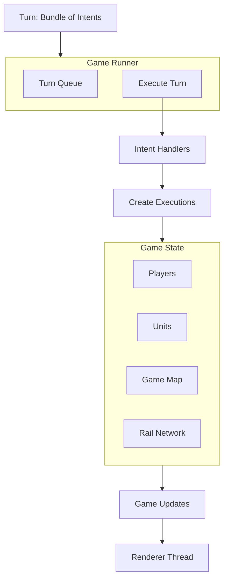

## Overview

The core simulation is the **heart of OpenFront** - a completely deterministic game engine that runs identically on all clients. It is written in **pure TypeScript** with zero external dependencies.

**Key Principles:**
- **Deterministic** - Same inputs always produce same outputs
- **Pure** - No side effects, randomness, or I/O
- **Thread-safe** - Runs in worker threads
- **Portable** - Works in browser, Node.js, and offline

<Warning>
  The core must remain **100% deterministic**. Never add:
  - `Math.random()` (use seeded RNG)
  - `Date.now()` (use tick counters)
  - External npm packages
  - File I/O or network calls
  - Non-deterministic algorithms
</Warning>

## Architecture Diagram



## Intent-Execution Model

The core uses a **two-phase architecture**:

### Phase 1: Intents

**Intents** are player requests that may or may not be valid:

```typescript
// Example intents
type Intent =
  | AttackIntent       // Attack another player
  | BuildStructureIntent // Build a factory/port
  | MoveWarshipIntent  // Move naval unit
  | SendNukeIntent     // Launch nuclear missile
  | AllianceRequestIntent // Request alliance
```

**File:** `src/core/Schemas.ts`

```typescript
export const AttackIntentSchema = z.object({
  type: z.literal("attack"),
  targetPlayerID: z.number(),
  troops: z.number(),
});

export type AttackIntent = z.infer<typeof AttackIntentSchema>;
```

### Phase 2: Executions

**Executions** are validated actions that modify game state:

```typescript
export interface Execution {
  // Initialize execution (called once)
  init(game: Game): void;
  
  // Execute one tick (called repeatedly)
  execute(game: Game): void;
  
  // Check if execution is complete
  isComplete(): boolean;
}
```

**Example:** Attack Execution

**File:** `src/core/execution/PlayerExecution.ts`

```typescript
class AttackExecution implements Execution {
  constructor(
    private attackerID: PlayerID,
    private defenderID: PlayerID,
    private troops: number,
  ) {}
  
  init(game: Game) {
    const attacker = game.player(this.attackerID);
    const defender = game.player(this.defenderID);
    
    // Validate attack is legal
    if (!attacker.canAttack(defender)) {
      return; // Invalid, do nothing
    }
    
    // Deduct troops from attacker
    attacker.removeTroops(this.troops);
    
    // Create attack object
    const attack = game.createAttack(
      attacker,
      defender,
      this.troops
    );
  }
  
  execute(game: Game) {
    // Attacks execute over multiple ticks
    // Move troops toward target
  }
  
  isComplete(): boolean {
    return this.attack.hasArrived();
  }
}
```

<Info>
  The **intent-execution split** ensures that invalid player actions don't crash the game. Intents can fail validation, but executions always succeed.
</Info>

## Game State

### GameImpl

**File:** `src/core/game/GameImpl.ts`

The main game state container:

```typescript
export class GameImpl implements Game {
  private _ticks = 0;
  private _players: Map<PlayerID, PlayerImpl> = new Map();
  private _units: UnitGrid; // Spatial grid for units
  private _terraNullius: TerraNulliusImpl; // Unclaimed territory
  private allianceRequests: AllianceRequestImpl[] = [];
  private alliances_: AllianceImpl[] = [];
  
  // Execute one game tick
  executeNextTick(): boolean {
    this._ticks++;
    
    // Execute all pending executions
    for (const exec of this.execs) {
      exec.execute(this);
    }
    
    // Remove completed executions
    this.execs = this.execs.filter(e => !e.isComplete());
    
    // Generate updates for renderer
    const updates = this.collectUpdates();
    this.sendUpdates(updates);
    
    return true;
  }
}
```

### Player State

**File:** `src/core/game/PlayerImpl.ts`

```typescript
export class PlayerImpl implements Player {
  private _id: PlayerID;
  private _troops: number;
  private _gold: number;
  private _territory: Set<TileRef> = new Set();
  private _units: Map<number, Unit> = new Map();
  private _isAlive: boolean = true;
  
  addTerritory(tile: TileRef) {
    this._territory.add(tile);
    this.game.setOwner(tile, this);
  }
  
  removeTroops(amount: number) {
    this._troops = Math.max(0, this._troops - amount);
  }
  
  canAfford(cost: number): boolean {
    return this._gold >= cost;
  }
}
```

### Unit System

**File:** `src/core/game/UnitImpl.ts`

Units represent structures and military assets:

```typescript
export class UnitImpl implements Unit {
  constructor(
    private _id: number,
    private _type: UnitType,
    private _owner: Player,
    private _tile: TileRef,
  ) {}
  
  // Unit types
  isFactory(): boolean { return this._type === UnitType.Factory; }
  isPort(): boolean { return this._type === UnitType.Port; }
  isWarship(): boolean { return this._type === UnitType.Warship; }
  isMissileSilo(): boolean { return this._type === UnitType.MissileSilo; }
}
```

**Unit Types:**

| Type | Purpose | File |
|------|---------|------|
| Factory | Troop production | `FactoryExecution.ts` |
| Port | Naval construction | `PortExecution.ts` |
| Warship | Naval combat | `WarshipExecution.ts` |
| TransportShip | Amphibious assault | `TransportShipExecution.ts` |
| TrainStation | Railroad hub | `TrainStationExecution.ts` |
| MissileSilo | Nuclear weapons | `NukeExecution.ts` |
| SAMLauncher | Anti-air defense | `SAMLauncherExecution.ts` |

### Spatial Indexing

**File:** `src/core/game/UnitGrid.ts`

Units are stored in a **spatial grid** for efficient queries:

```typescript
export class UnitGrid {
  private grid: Map<CellString, Unit[]> = new Map();
  
  add(unit: Unit) {
    const key = this.cellKey(unit.tile());
    const units = this.grid.get(key) ?? [];
    units.push(unit);
    this.grid.set(key, units);
  }
  
  unitsAt(tile: TileRef): Unit[] {
    return this.grid.get(this.cellKey(tile)) ?? [];
  }
  
  findNearby(tile: TileRef, radius: number): Unit[] {
    const results: Unit[] = [];
    for (let dx = -radius; dx <= radius; dx++) {
      for (let dy = -radius; dy <= radius; dy++) {
        results.push(...this.unitsAt({ x: tile.x + dx, y: tile.y + dy }));
      }
    }
    return results;
  }
}
```

## GameRunner

**File:** `src/core/GameRunner.ts`

Orchestrates turn execution:

```typescript
export class GameRunner {
  private turnQueue: Turn[] = [];
  
  addTurn(turn: Turn) {
    this.turnQueue.push(turn);
  }
  
  pendingTurns(): number {
    return this.turnQueue.length;
  }
  
  executeNextTick(maxTurns: number): boolean {
    if (this.turnQueue.length === 0) return false;
    
    const turn = this.turnQueue.shift()!;
    
    // Convert intents to executions
    for (const intent of turn.intents) {
      const execution = this.createExecution(intent);
      if (execution) {
        this.game.addExecution(execution);
      }
    }
    
    // Execute one tick
    return this.game.executeNextTick();
  }
  
  private createExecution(intent: Intent): Execution | null {
    switch (intent.type) {
      case "attack":
        return new AttackExecution(...);
      case "build_structure":
        return new BuildStructureExecution(...);
      case "move_warship":
        return new MoveWarshipExecution(...);
      // ... more intent types
    }
  }
}
```

<Note>
  The `GameRunner` processes turns in **batches** to catch up if the client falls behind the server. It executes up to 4 ticks before yielding to avoid blocking the worker thread.
</Note>

## Execution Types

### Structure Executions

Building construction and upgrades:

**File:** `src/core/execution/FactoryExecution.ts`

```typescript
export class FactoryExecution implements Execution {
  private factory: Unit | null = null;
  
  init(game: Game) {
    const player = game.player(this.playerID);
    const tile = game.ref(this.x, this.y);
    
    // Check if player can build
    if (!player.canAfford(FACTORY_COST)) return;
    if (!player.owns(tile)) return;
    
    // Deduct cost
    player.removeGold(FACTORY_COST);
    
    // Create factory unit
    this.factory = game.createUnit(
      UnitType.Factory,
      player,
      tile
    );
  }
  
  execute(game: Game) {
    if (!this.factory) return;
    
    // Factories produce troops each tick
    const owner = this.factory.owner();
    owner.addTroops(FACTORY_PRODUCTION_RATE);
  }
}
```

### Combat Executions

Attack and defense mechanics:

**File:** `src/core/execution/PlayerExecution.ts`

```typescript
class CombatExecution implements Execution {
  execute(game: Game) {
    const attacker = this.attack.attacker();
    const defender = this.attack.defender();
    
    // Move troops toward target
    this.attack.advance(ATTACK_SPEED);
    
    if (this.attack.hasArrived()) {
      // Calculate combat outcome
      const attackPower = this.attack.troops();
      const defensePower = defender.troops() * DEFENSE_MULTIPLIER;
      
      if (attackPower > defensePower) {
        // Attacker wins - capture territory
        this.conquerTerritory(defender, attacker);
      } else {
        // Defender wins - repel attack
        defender.removeTroops(attackPower / DEFENSE_MULTIPLIER);
      }
    }
  }
}
```

### AI Nation Executions

Bot behavior:

**File:** `src/core/execution/NationExecution.ts`

```typescript
export class NationExecution implements Execution {
  execute(game: Game) {
    const nation = game.player(this.nationID);
    
    // Expand territory
    this.expandTerritory(nation, game);
    
    // Build structures
    this.buildStructures(nation, game);
    
    // Attack enemies
    this.attackEnemies(nation, game);
    
    // Form alliances
    this.manageAlliances(nation, game);
  }
}
```

**AI Modules:**

**File:** `src/core/execution/nation/`

- `NationStructureBehavior.ts` - Building placement AI
- `NationWarshipBehavior.ts` - Naval strategy
- `NationNukeBehavior.ts` - Nuclear weapon usage
- `NationAllianceBehavior.ts` - Diplomacy decisions

## Pathfinding

The core includes multiple **A* pathfinding** variants for different unit types.

### Pathfinding Types

| Algorithm | Use Case | File |
|-----------|----------|------|
| AStar.ts | Ground units | `src/core/pathfinding/algorithms/AStar.ts` |
| AStar.Water.ts | Naval units | `src/core/pathfinding/algorithms/AStar.Water.ts` |
| AStar.Air.ts | Missiles | `src/core/pathfinding/PathFinder.Air.ts` |
| AStar.Rail.ts | Railroad trains | `src/core/pathfinding/algorithms/AStar.Rail.ts` |
| AStar.WaterHierarchical.ts | Long-distance naval | `src/core/pathfinding/algorithms/AStar.WaterHierarchical.ts` |

### PathFinder Interface

**File:** `src/core/pathfinding/PathFinder.ts`

```typescript
export interface PathFinder {
  findPath(
    start: Cell,
    goal: Cell,
    maxSteps?: number
  ): Cell[] | null;
}
```

### Example: Water Pathfinding

**File:** `src/core/pathfinding/algorithms/AStar.Water.ts`

```typescript
export class AStarWater implements PathFinder {
  findPath(start: Cell, goal: Cell): Cell[] | null {
    const openSet = new PriorityQueue<Node>();
    const closedSet = new Set<CellString>();
    
    openSet.push({
      cell: start,
      g: 0,
      h: this.heuristic(start, goal),
    });
    
    while (!openSet.isEmpty()) {
      const current = openSet.pop()!;
      
      if (current.cell.equals(goal)) {
        return this.reconstructPath(current);
      }
      
      closedSet.add(current.cell.toString());
      
      // Explore neighbors (only water tiles)
      for (const neighbor of this.getWaterNeighbors(current.cell)) {
        if (closedSet.has(neighbor.toString())) continue;
        
        const g = current.g + this.cost(current.cell, neighbor);
        const h = this.heuristic(neighbor, goal);
        
        openSet.push({ cell: neighbor, g, h, parent: current });
      }
    }
    
    return null; // No path found
  }
}
```

### Railroad Network

**File:** `src/core/game/RailNetwork.ts`

Railroads form a **graph structure** for train pathfinding:

```typescript
export class RailNetworkImpl implements RailNetwork {
  private stations: Map<number, TrainStation> = new Map();
  private connections: Map<number, number[]> = new Map();
  
  addStation(station: TrainStation) {
    this.stations.set(station.id(), station);
  }
  
  connectStations(station1: number, station2: number) {
    this.connections.get(station1)?.push(station2);
    this.connections.get(station2)?.push(station1);
  }
  
  findRoute(start: number, end: number): number[] | null {
    // BFS to find shortest rail path
    return this.bfs(start, end);
  }
}
```

## Game Updates

The core sends **binary packed updates** to the rendering thread for efficiency.

### Update Types

**File:** `src/core/game/GameUpdates.ts`

```typescript
export enum GameUpdateType {
  Tile,           // Territory ownership changes
  Unit,           // Unit creation/destruction
  Player,         // Player stats (troops, gold)
  Attack,         // Active attacks
  Alliance,       // Alliance formation/breaks
  Message,        // Chat messages
  Nuke,           // Nuclear explosions
  Win,            // Game over
  Hash,           // State hash for desync detection
}
```

### Packed Tile Updates

```typescript
interface GameUpdateViewData {
  // Packed as Uint32Array for efficiency
  packedTileUpdates: Uint32Array; // [x, y, ownerID, x, y, ownerID, ...]
  packedMotionPlans?: Uint32Array; // Attack movement paths
  
  updates: {
    [GameUpdateType.Unit]: UnitUpdate[];
    [GameUpdateType.Player]: PlayerUpdate[];
    [GameUpdateType.Attack]: AttackUpdate[];
    // ...
  };
}
```

**Packing Format:**

```typescript
// Pack tile update
function packTileUpdate(x: number, y: number, ownerID: number): number[] {
  return [x, y, ownerID];
}

// Unpack on renderer side
function unpackTileUpdate(packed: Uint32Array, offset: number) {
  return {
    x: packed[offset],
    y: packed[offset + 1],
    ownerID: packed[offset + 2],
  };
}
```

<Info>
  Binary packing reduces update size by **80%** compared to JSON, critical for large maps with 40,000 tiles.
</Info>

## Determinism Guarantees

### Seeded Random Number Generator

**File:** `src/core/Util.ts`

```typescript
class SeededRandom {
  private seed: number;
  
  constructor(seed: number) {
    this.seed = seed;
  }
  
  next(): number {
    // Linear congruential generator (LCG)
    this.seed = (this.seed * 1103515245 + 12345) % 2147483648;
    return this.seed / 2147483648;
  }
  
  nextInt(max: number): number {
    return Math.floor(this.next() * max);
  }
}
```

### Hash Computation

State hashing for desync detection:

```typescript
export function simpleHash(str: string): number {
  let hash = 0;
  for (let i = 0; i < str.length; i++) {
    const char = str.charCodeAt(i);
    hash = ((hash << 5) - hash) + char;
    hash = hash & hash; // Convert to 32-bit integer
  }
  return hash;
}

// Compute game state hash
function computeStateHash(game: Game): string {
  const state = {
    tick: game.ticks(),
    players: game.players().map(p => ({
      id: p.id(),
      troops: p.troops(),
      gold: p.gold(),
      territoryCount: p.territory().size,
    })),
    units: game.units().map(u => ({
      id: u.id(),
      type: u.type(),
      x: u.tile().x,
      y: u.tile().y,
    })),
  };
  
  return simpleHash(JSON.stringify(state)).toString();
}
```

### Determinism Checklist

<Warning>
  Before adding new code to `src/core/`, verify:
  
  - ✅ No `Math.random()` (use SeededRandom)
  - ✅ No `Date.now()` (use tick counter)
  - ✅ No external imports (pure TypeScript only)
  - ✅ No floating point errors (use integers)
  - ✅ No object iteration (order not guaranteed)
  - ✅ Arrays sorted before iteration
  - ✅ Maps iterated in sorted key order
</Warning>

## Testing Strategy

### Determinism Tests

```typescript
test("Same intents produce same state", () => {
  const game1 = createGame(config);
  const game2 = createGame(config);
  
  const intents = [
    { type: "attack", playerID: 1, targetID: 2, troops: 100 },
    { type: "build", playerID: 2, x: 10, y: 20, unitType: "factory" },
  ];
  
  // Execute same intents on both games
  for (const intent of intents) {
    game1.addIntent(intent);
    game2.addIntent(intent);
  }
  
  game1.executeNextTick();
  game2.executeNextTick();
  
  // State hashes must match
  expect(computeStateHash(game1)).toBe(computeStateHash(game2));
});
```

### Replay Tests

Replays verify determinism by re-executing recorded games:

```typescript
test("Replay produces same outcome", () => {
  const gameRecord = loadGameRecord("recorded_game.json");
  
  const game = createGame(gameRecord.config);
  
  // Execute all recorded turns
  for (const turn of gameRecord.turns) {
    game.addTurn(turn);
    game.executeNextTick();
  }
  
  // Winner must match recorded winner
  expect(game.winner()).toBe(gameRecord.winner);
});
```

## Performance Optimization

### Object Pooling

```typescript
class ExecutionPool {
  private pool: Execution[] = [];
  
  acquire(type: string): Execution {
    return this.pool.pop() ?? this.create(type);
  }
  
  release(execution: Execution) {
    execution.reset();
    this.pool.push(execution);
  }
}
```

### Spatial Partitioning

Units are indexed in a grid for O(1) spatial queries instead of O(n) iteration.

### Tick Budget

Worker thread limits execution time per tick:

```typescript
const MAX_TICK_TIME = 100; // ms

function executeNextTick() {
  const startTime = performance.now();
  
  while (this.hasWork() && performance.now() - startTime < MAX_TICK_TIME) {
    this.executeNextExecution();
  }
}
```

## Next Steps

<CardGroup cols={2}>
  <Card title="Client Architecture" icon="desktop" href="/technical/client">
    How the client renders game updates
  </Card>
  <Card title="Server Architecture" icon="server" href="/technical/server">
    How the server relays turns
  </Card>
</CardGroup>