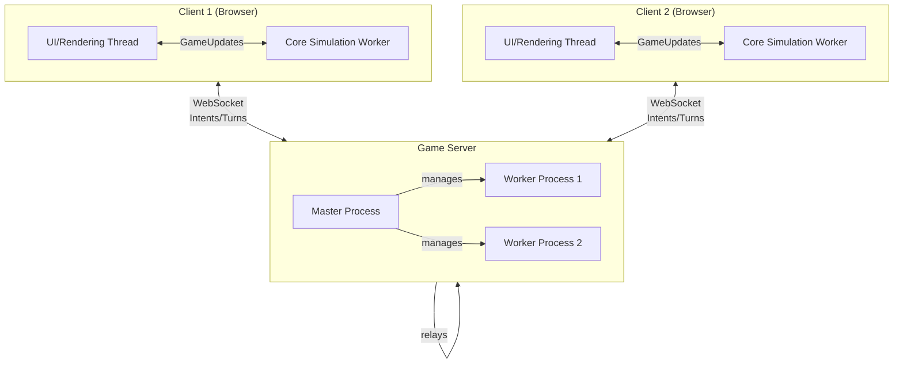
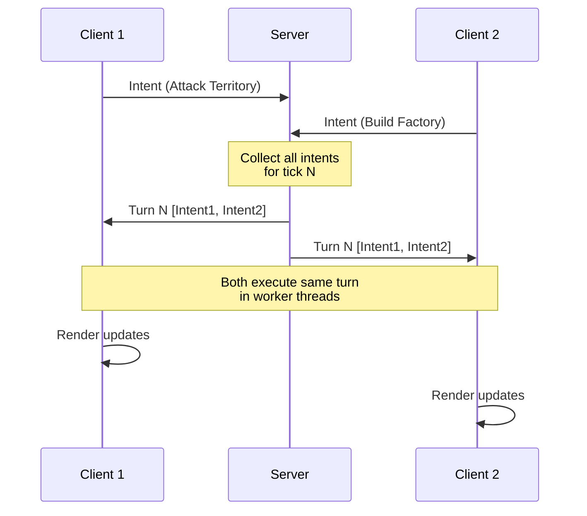

## Architecture Philosophy

OpenFront employs a unique architecture where the **game simulation runs entirely client-side** in worker threads, while the server acts solely as a relay for player intents. This design ensures:

- **Deterministic gameplay** - All clients simulate the same game state
- **Low server costs** - Server only relays messages, doesn't run game logic
- **Offline capability** - Singleplayer games run completely locally
- **Anti-cheat via consensus** - Multiple clients verify game state

## System Components

The game is split into four main components:

<CardGroup cols={2}>
  <Card title="Client" icon="desktop" href="/technical/client">
    Handles rendering, UI, and runs the core simulation in a worker thread
  </Card>
  <Card title="Server" icon="server" href="/technical/server">
    Relays intents between clients using WebSockets and Express
  </Card>
  <Card title="Core Simulation" icon="gears" href="/technical/core-simulation">
    Deterministic, pure TypeScript game engine with no external dependencies
  </Card>
  <Card title="API" icon="cloud">
    Closed-source Cloudflare Worker handling auth, stats, and monetization
  </Card>
</CardGroup>

## Architecture Diagram



## Data Flow

The core game loop follows an intent-execution model:

### Intent → Execution Flow

1. **User Action** - Player performs action (attack, build, move)
2. **Intent Creation** - Client creates an "Intent" object
3. **Send to Server** - Intent sent via WebSocket to game server
4. **Bundle Intents** - Server collects all intents for current tick
5. **Relay Turn** - Server sends bundled "Turn" to all clients
6. **Execution** - Each client's core creates "Execution" objects
7. **State Update** - Executions modify game state deterministically
8. **Render** - Core sends GameUpdates to rendering thread

<Info>
  Intents are **requests** from players, while Executions are **validated actions** that modify game state. This separation ensures determinism across all clients.
</Info>

### Turn Synchronization



## Key Design Principles

### 1. Determinism

The core simulation (`src/core/`) is **completely deterministic**:
- No `Math.random()` - uses seeded RNG
- No `Date.now()` - uses tick counters
- No external dependencies - pure TypeScript
- Identical input → identical output across all clients

### 2. Thread Separation

The client uses a **multi-threaded architecture**:
- **Main thread** - UI, rendering, user input (60 FPS)
- **Worker thread** - Core simulation (variable tick rate)
- Communication via `postMessage` with transferable buffers

### 3. Server as Relay

The server **never runs game logic**:
- No validation of intents (handled by core)
- No game state storage (state lives in clients)
- Only coordinates turn synchronization
- Clustering support via Node.js cluster module

### 4. Progressive Enhancement

Game modes build on the architecture:
- **Singleplayer** - No server, fully offline
- **Private lobbies** - Custom server relay
- **Public matchmaking** - Managed by API + server
- **Replays** - Replay intents through core

## Technology Stack

### Client
- **TypeScript** - Type-safe game logic
- **PixiJS** - WebGL rendering
- **Web Workers** - Threaded simulation
- **Vite** - Build tooling

### Server  
- **Node.js** - Runtime environment
- **Express** - HTTP server
- **ws** - WebSocket library
- **cluster** - Process management

### Core
- **Pure TypeScript** - No runtime dependencies
- **Custom pathfinding** - A* variants for land/sea/air/rail
- **Binary protocols** - Efficient state updates

<Warning>
  The core simulation must remain **pure and deterministic**. Never add:
  - External npm packages
  - Random number generation without seeding
  - System time dependencies
  - File I/O or network calls
</Warning>

## Performance Characteristics

### Client Performance
- Simulation runs at variable tick rate (200-1000ms per tick)
- Rendering at 60 FPS independent of simulation
- Large maps: 200x200 tiles, 400+ AI nations
- Worker thread prevents UI blocking

### Server Scalability  
- Stateless relay design scales horizontally
- Clustering across CPU cores
- Low memory footprint (~100MB per worker)
- WebSocket connections pooled per game

## File Structure

```
src/
├── client/           # Main thread: UI and rendering
│   ├── graphics/     # PixiJS rendering layers
│   ├── components/   # UI components
│   └── ClientGameRunner.ts  # Client orchestration
│
├── core/             # Deterministic simulation
│   ├── game/         # Game state and logic
│   ├── execution/    # Intent → Execution handlers
│   ├── pathfinding/  # A* pathfinding algorithms
│   └── worker/       # Worker thread interface
│
└── server/           # Game server
    ├── Server.ts     # Entry point
    ├── Master.ts     # Master process
    ├── Worker.ts     # Worker process
    ├── GameServer.ts # Game session management
    └── GameManager.ts # Multi-game coordination
```

## Next Steps

<CardGroup cols={3}>
  <Card title="Client Architecture" icon="desktop" href="/technical/client">
    Deep dive into rendering and worker threads
  </Card>
  <Card title="Server Architecture" icon="server" href="/technical/server">
    WebSocket relay and clustering
  </Card>
  <Card title="Core Simulation" icon="gears" href="/technical/core-simulation">
    Deterministic game engine internals
  </Card>
</CardGroup>