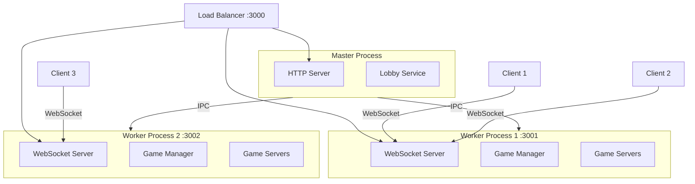

## Overview

The OpenFront server is a **stateless relay** that coordinates turn synchronization between clients. It does **not** run game simulation - that happens entirely client-side.

**Key Characteristics:**
- Relays player intents between clients
- Manages lobby state and player connections
- Clustering support for horizontal scaling
- WebSocket-based real-time communication
- Low memory footprint (~100MB per worker)

## Architecture Diagram



## Process Model

### Master-Worker Clustering

The server uses Node.js **cluster module** for multi-process architecture.

**File:** `src/server/Server.ts`

```typescript
import cluster from "cluster";

async function main() {
  if (cluster.isPrimary) {
    console.log("Starting master process...");
    await startMaster();
  } else {
    console.log("Starting worker process...");
    await startWorker();
  }
}
```

### Master Process

**File:** `src/server/Master.ts`

The master process:
- Serves static files (HTML, JS, assets)
- Routes API requests to workers
- Manages worker lifecycle (fork, restart on crash)
- Handles health checks

```typescript
export async function startMaster() {
  const numWorkers = config.numWorkers(); // CPU cores
  
  // Fork workers
  for (let i = 0; i < numWorkers; i++) {
    const worker = cluster.fork({
      WORKER_ID: i,
      ADMIN_TOKEN,
      INSTANCE_ID,
    });
    
    lobbyService.registerWorker(i, worker);
  }
  
  // Handle worker crashes
  cluster.on("exit", (worker, code, signal) => {
    const workerId = worker.process.env.WORKER_ID;
    console.log(`Worker ${workerId} died, restarting...`);
    
    const newWorker = cluster.fork({ WORKER_ID: workerId });
    lobbyService.registerWorker(workerId, newWorker);
  });
}
```

<Info>
  The master process **automatically restarts** crashed workers, providing fault tolerance for the server cluster.
</Info>

### Worker Process

**File:** `src/server/Worker.ts`

Each worker process:
- Runs an Express HTTP server
- Runs a WebSocket server
- Manages multiple game sessions via `GameManager`
- Handles WebSocket connections and message routing

```typescript
export async function startWorker() {
  const app = express();
  const server = http.createServer(app);
  const wss = new WebSocketServer({ noServer: true });
  
  const gm = new GameManager(config, log);
  const lobbyService = new WorkerLobbyService(server, wss, gm, log);
  
  const PORT = config.workerPortByIndex(workerId);
  server.listen(PORT);
}
```

**Port Assignment:**
- Master: Port 3000
- Worker 0: Port 3001
- Worker 1: Port 3002
- Worker N: Port 3001 + N

## Game Session Management

### GameManager

**File:** `src/server/GameManager.ts`

Manages multiple concurrent game sessions:

```typescript
export class GameManager {
  private games: Map<GameID, GameServer> = new Map();
  
  createGame(
    id: GameID,
    gameConfig: GameConfig,
    creatorPersistentID?: string,
  ): GameServer {
    const game = new GameServer(id, this.log, Date.now(), gameConfig);
    this.games.set(id, game);
    return game;
  }
  
  joinClient(client: Client, gameID: GameID) {
    const game = this.games.get(gameID);
    if (!game) return "not_found";
    return game.joinClient(client);
  }
  
  tick() {
    for (const [id, game] of this.games) {
      if (game.phase() === GamePhase.Finished) {
        game.end();
        this.games.delete(id); // Clean up finished games
      }
    }
  }
}
```

### GameServer

**File:** `src/server/GameServer.ts`

Represents a single game session:

```typescript
export class GameServer {
  private turns: Turn[] = [];
  private intents: StampedIntent[] = [];
  private activeClients: Client[] = [];
  private _phase: GamePhase = GamePhase.Lobby;
  
  start() {
    this._phase = GamePhase.Active;
    this._startTime = Date.now();
    
    // Send start message to all clients
    this.broadcast({
      type: "start",
      gameStartInfo: this.gameStartInfo,
      myClientID: client.id,
      turns: this.turns,
    });
    
    // Start tick loop
    this.endTurnIntervalID = setInterval(() => {
      this.endTurn();
    }, this.tickRate());
  }
  
  private endTurn() {
    const turn: Turn = {
      turnNumber: this.turns.length,
      intents: this.intents,
    };
    
    this.turns.push(turn);
    this.intents = []; // Reset for next turn
    
    // Broadcast turn to all clients
    this.broadcast({ type: "turn", turn });
  }
}
```

<Note>
  The `GameServer` manages the **turn clock** that synchronizes all clients. Each turn bundles all intents received during the tick interval.
</Note>

### Game Phases

```typescript
export enum GamePhase {
  Lobby = "LOBBY",      // Waiting for players
  Active = "ACTIVE",    // Game in progress
  Finished = "FINISHED" // Game ended
}
```

**Phase Transitions:**
1. **Lobby** - Players join, configure settings
2. **Active** - Game starts, turn loop begins
3. **Finished** - Winner declared, game archived

## WebSocket Communication

### Connection Handling

**File:** `src/server/Worker.ts:280-507`

```typescript
wss.on("connection", (ws: WebSocket, req) => {
  ws.on("message", async (message: string) => {
    const parsed = ClientMessageSchema.safeParse(JSON.parse(message));
    
    if (parsed.data.type === "join") {
      // Verify token
      const result = await verifyClientToken(clientMsg.token, config);
      if (result.type === "error") {
        ws.close(1002, "Unauthorized");
        return;
      }
      
      // Create client and add to game
      const client = new Client(
        generateID(),
        persistentId,
        ip,
        username,
        ws,
      );
      
      gm.joinClient(client, clientMsg.gameID);
    }
  });
});
```

### Client Object

**File:** `src/server/Client.ts`

```typescript
export class Client {
  constructor(
    public readonly id: ClientID,
    public readonly persistentID: string,
    public readonly ip: string,
    public username: string,
    private ws: WebSocket,
  ) {}
  
  send(message: ServerMessage) {
    this.ws.send(JSON.stringify(message));
  }
  
  onMessage(handler: (msg: ClientMessage) => void) {
    this.ws.on("message", (data) => {
      const msg = JSON.parse(data.toString());
      handler(msg);
    });
  }
}
```

### Message Flow

**Client → Server:**

```typescript
// Join game
{
  type: "join",
  gameID: "abc123",
  username: "Player1",
  token: "jwt_token",
  cosmetics: { flag: "us", color: 0xFF0000 }
}

// Send intent
{
  type: "intent",
  intent: {
    type: "attack",
    targetPlayerID: 5,
    troops: 100
  }
}
```

**Server → Client:**

```typescript
// Lobby info
{
  type: "lobby_info",
  myClientID: 1,
  lobby: {
    players: [...],
    config: {...}
  }
}

// Turn bundle
{
  type: "turn",
  turn: {
    turnNumber: 42,
    intents: [
      { clientID: 1, type: "attack", ... },
      { clientID: 2, type: "build", ... }
    ]
  }
}
```

## API Endpoints

### Game Management

```typescript
// Create new game
POST /api/create_game/:id
Body: GameConfig
Response: GameInfo

// Start private lobby
POST /api/start_game/:id
Response: { success: true }

// Check if game exists  
GET /api/game/:id/exists
Response: { exists: boolean }

// Get game info
GET /api/game/:id
Response: GameInfo
```

### Health & Status

```typescript
// Health check
GET /api/health
Response: { status: "ok" | "unavailable" }

// Environment
GET /api/env
Response: { game_env: "dev" | "prod" }
```

### Game Archives

```typescript
// Archive singleplayer game
POST /api/archive_singleplayer_game
Body: PartialGameRecord
Response: { success: true }
```

<Warning>
  Only **singleplayer games** can be archived via this endpoint. Multiplayer games are archived automatically by the server when they end.
</Warning>

## Authentication & Authorization

### JWT Verification

**File:** `src/server/jwt.ts`

```typescript
export async function verifyClientToken(
  token: string,
  config: ServerConfig
): Promise<VerifyResult> {
  try {
    const jwks = await fetchJWKS(config.jwtIssuer());
    const decoded = await jwtVerify(token, jwks);
    
    return {
      type: "success",
      persistentId: decoded.payload.sub,
      claims: decoded.payload,
    };
  } catch (error) {
    return { type: "error", message: error.message };
  }
}
```

### Turnstile (Bot Protection)

**File:** `src/server/Turnstile.ts`

Cloudflare Turnstile verification for bot prevention:

```typescript
export async function verifyTurnstileToken(
  ip: string,
  token: string,
  secretKey: string
): Promise<TurnstileResult> {
  const response = await fetch(
    "https://challenges.cloudflare.com/turnstile/v0/siteverify",
    {
      method: "POST",
      headers: { "Content-Type": "application/json" },
      body: JSON.stringify({ secret: secretKey, response: token }),
    }
  );
  
  const data = await response.json();
  return data.success ? { status: "approved" } : { status: "rejected" };
}
```

## Desync Detection

Clients send state hashes to detect simulation divergence:

```typescript
// Client sends hash after each tick
{
  type: "hash",
  tick: 42,
  hash: "a3f5c8..."
}

// Server compares hashes from all clients
private checkDesync(tick: number) {
  const hashes = this.clientHashes.get(tick);
  const uniqueHashes = new Set(hashes.values());
  
  if (uniqueHashes.size > 1) {
    // Desync detected!
    this.broadcast({
      type: "desync",
      tick,
      expected: mostCommonHash,
    });
  }
}
```

<Info>
  Hash mismatches indicate **non-deterministic behavior** in the core simulation. This is a critical bug that must be fixed.
</Info>

## Load Balancing & Routing

### Worker Assignment

Games are assigned to workers using **consistent hashing**:

```typescript
workerIndex(gameID: GameID): number {
  const hash = simpleHash(gameID);
  return hash % this.numWorkers();
}
```

This ensures:
- Same game always routes to same worker
- Even distribution across workers
- No shared state needed between workers

### Path Prefixes

Requests include worker ID in path:

```
GET /w0/api/game/abc123  → Worker 0
GET /w1/api/game/def456  → Worker 1
WS  /w0/               → Worker 0 WebSocket
```

## Matchmaking Integration

**File:** `src/server/Worker.ts:535-593`

Workers poll the matchmaking API to receive game assignments:

```typescript
async function startMatchmakingPolling(gm: GameManager) {
  startPolling(async () => {
    const gameId = generateGameIdForWorker();
    
    const response = await fetch(`${apiUrl}/matchmaking/checkin`, {
      method: "POST",
      headers: { "x-api-key": config.apiKey() },
      body: JSON.stringify({
        id: workerId,
        gameId: gameId,
        ccu: gm.activeClients(), // Current player count
        instanceId: process.env.INSTANCE_ID,
      }),
    });
    
    const data = await response.json();
    
    if (data.assignment) {
      // Create matchmaking game
      gm.createGame(gameId, playlist.get1v1Config());
    }
  }, 5000); // Poll every 5 seconds
}
```

## Monitoring & Observability

### Metrics

**File:** `src/server/WorkerMetrics.ts`

OpenTelemetry metrics for monitoring:

```typescript
export function initWorkerMetrics(gm: GameManager) {
  const meter = metrics.getMeter("openfrontServer");
  
  // Active games
  meter.createObservableGauge("active_games", {
    description: "Number of active games",
  }).addCallback((result) => {
    result.observe(gm.activeGames());
  });
  
  // Connected clients
  meter.createObservableGauge("active_clients", {
    description: "Number of connected clients",
  }).addCallback((result) => {
    result.observe(gm.activeClients());
  });
  
  // Desync count
  meter.createObservableGauge("desync_count", {
    description: "Total desync events",
  }).addCallback((result) => {
    result.observe(gm.desyncCount());
  });
}
```

### Logging

**File:** `src/server/Logger.ts`

Structured logging with Winston:

```typescript
import winston from "winston";

export const logger = winston.createLogger({
  level: "info",
  format: winston.format.json(),
  transports: [
    new winston.transports.Console(),
    new winston.transports.File({ filename: "error.log", level: "error" }),
  ],
});
```

## Configuration

**File:** `src/core/configuration/Config.ts`

Server configuration from environment variables:

```typescript
export class ServerConfig {
  numWorkers(): number {
    return parseInt(process.env.NUM_WORKERS ?? "4");
  }
  
  workerPortByIndex(index: number): number {
    return 3001 + index;
  }
  
  jwtIssuer(): string {
    return process.env.JWT_ISSUER ?? "https://api.openfrontgame.com";
  }
  
  apiKey(): string {
    return process.env.API_KEY ?? "";
  }
}
```

## Deployment

### Environment Variables

```bash
# Server
NUM_WORKERS=4          # Number of worker processes
GAME_ENV=production    # dev | production

# Authentication
JWT_ISSUER=https://api.openfrontgame.com
API_KEY=your_api_key

# Cloudflare Turnstile
TURNSTILE_SECRET_KEY=your_secret

# Observability
OTEL_ENABLED=true
```

### Docker

```dockerfile
FROM node:20-alpine

WORKDIR /app

COPY package*.json ./
RUN npm ci --production

COPY dist/ ./dist/
COPY static/ ./static/

EXPOSE 3000

CMD ["node", "dist/server/Server.js"]
```

## Performance Tuning

### Connection Limits

```typescript
// Limit WebSocket connections per game
const MAX_PLAYERS_PER_GAME = 50;

// Rate limiting
app.use(rateLimit({
  windowMs: 1000,
  max: 20, // 20 requests per second per IP
}));
```

### Memory Management

```typescript
// Clean up finished games
tick() {
  for (const [id, game] of this.games) {
    if (game.phase() === GamePhase.Finished) {
      game.end();
      this.games.delete(id);
    }
  }
}
```

## Next Steps

<CardGroup cols={2}>
  <Card title="Client Architecture" icon="desktop" href="/technical/client">
    Learn how clients render and input handling
  </Card>
  <Card title="Core Simulation" icon="gears" href="/technical/core-simulation">
    Understand the deterministic game engine
  </Card>
</CardGroup>